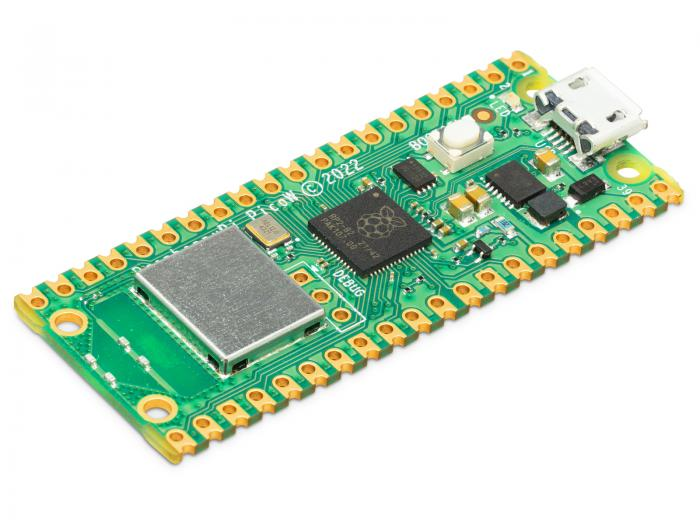
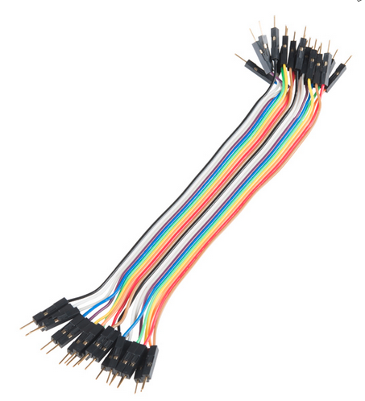
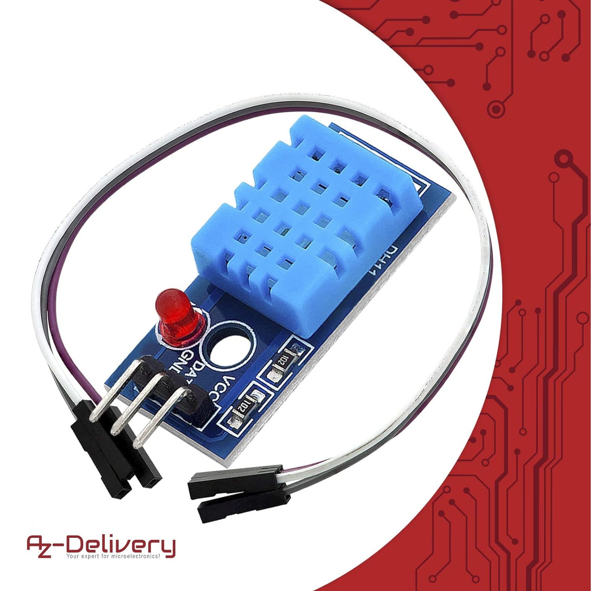
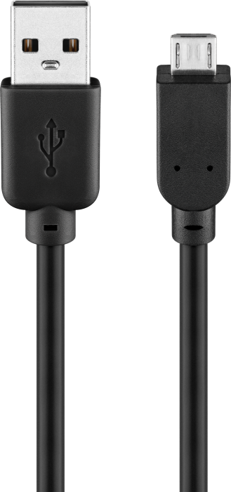
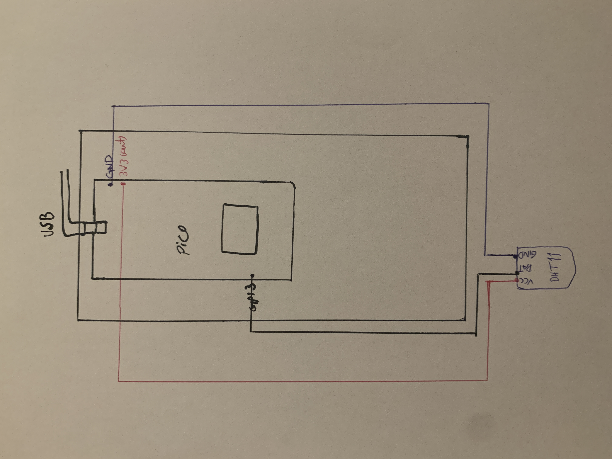

# Tutorial on How to Build a Temperature and Humidity Sensor 

## Building a Temperature and Humidity Sensor with Raspberry Pi Pico W

## Elham Tayebi, et223dt

## Short Project Overview 
In this project, we will focus on building a simple temperature and humidity IoT device using the Raspberry Pi Pico W and a DHT11 sensor. The tutorial involves computer setup, setting up the hardware and using a cloud-based service such as Adafruit io to monitor the data sent by the sensor. This project will take approximately 6-7 hours to complete. 

## Objective 
### Why I Chose This Project?
I chose this project to learn the basics of IoT by building my first IoT device. This project helped me understand how to use a microcontroller (Raspberry Pi Pico W) and connect it to WiFi, how to connect sensors and use cloud services to send data. It is a simple way to get some experiences with IoT and prepare for more advanced projects in the future.

### What purpose does the project serve?
The device serves as a starting point for developing more advance IoT devices. It monitors temperature and humidity, providing a foundation for projects like home automation or weather stations. The project provides a foundation for future IoT applications. 

### What Insights You Think It Will Give

You will learn how to set up and use the Raspberry Pi Pico W, send data to cloud servers and build a basic IoT device by following this tutorial. 

## Material

| Hardware |Image| Price(SEK)/Link|
|----------|----------|----------|
|Raspberry Pi Pico W|    |    [89](https://www.electrokit.com/raspberry-pi-pico-w)     |
|Breadboard    |          |      [49](https://www.electrokit.com/kopplingsdack-400-anslutningar)   |
|Jumperwires     |          |    [29](https://www.electrokit.com/labbsladd-20-pin-15cm-hane/hane)      |
|DHT11    |          |        [99](https://www.amazon.se/AZDelivery-breakout-modul-Temperatursensor-fuktighetssensor-kompatibel/dp/B07CK598SZ/ref=asc_df_B07CK598SZ/?tag=shpngadsglede-21&linkCode=df0&hvadid=604528123148&hvpos=&hvnetw=g&hvrand=1784732445850451503&hvpone=&hvptwo=&hvqmt=&hvdev=c&hvdvcmdl=&hvlocint=&hvlocphy=1012442&hvtargid=pla-709785471256&mcid=fa9321191f2b374fba918f1bb28c8eda&th=1)  |
|Micro-USB cable    |    |   [39](https://www.electrokit.com/usb-kabel-a-hane-micro-b-5p-hane-1.8m)      |
|Total    |          |   305       |

Raspberry Pi Pico W is a microcontroller with WiFi which is used for IoT applications. The DHT11 sensor measures temperature and humidity. Jumper wires and breadboard are used to connect components. 

## Computer Setup
The chosen IDE for this project is Visual Studio Code (VS Code) and the project has been developed on a macOS operating system. 
You need also follow the following steps in order to prepare your computer for the project:
1. [VS code](https://code.visualstudio.com/Download) can be downloaded and installed.
2. [Node.js](https://nodejs.org/en/download/package-manager) can be downloaded and installed.
3. A plug-in called Pymakr is also needed for the project. To install it, open VS code and access the Extensions manager by clicking on the left panel icon, navigating View >> Extensions, or simply by pressing Ctrl+shift+X. 

### Flashing the Raspberry Pi Pico W

1. Download the latest MicroPython firmware(UF2 file) form [this website's ](https://micropython.org/download/RPI_PICO_W/) Releases section.
2. Carefully, connect the micro-USB to the Pico W.
3. Hold down the BOOTSEL button and connect the USB Type-A end of the cable to your computer. Release the button once connected.
4. A new drive named RPI-RP2 will appear. Copy the UF2 file to this drive.
5. Wait for the board to automatically disconnect (drive disappears).
6. To verify the board is ready, disconnect and reconnect the USB cable.

**Note:**  If your device is stuck, you can follow the firmware update procedure with [this special](https://datasheets.raspberrypi.com/soft/flash_nuke.uf2) firmware to completely erase the memory. Afterward, you can follow the previous steps to flash the Pico again. 

## Putting everything together
The DHT11 sensor has three pins: VCC, DATA and GND. Connect the VCC pin on the DHT11 sensor to the 3V3(out) on the Raspberry Pi Pico W. By doing so, you ensure that the sensor is powered correctly and can communicate with the Pico. Then, connect the GND pin of the DHT11 to any GND pin on the Raspberry Pi Pico W. Here, it is attached to pin 38. Finally, Link the DATA pin on DHT11 to GP13. Digital signals can be sent from sensor to the Pico by DATA pin. See the circuit diagram for a clearer understanding of how to connect all the components. 

   

