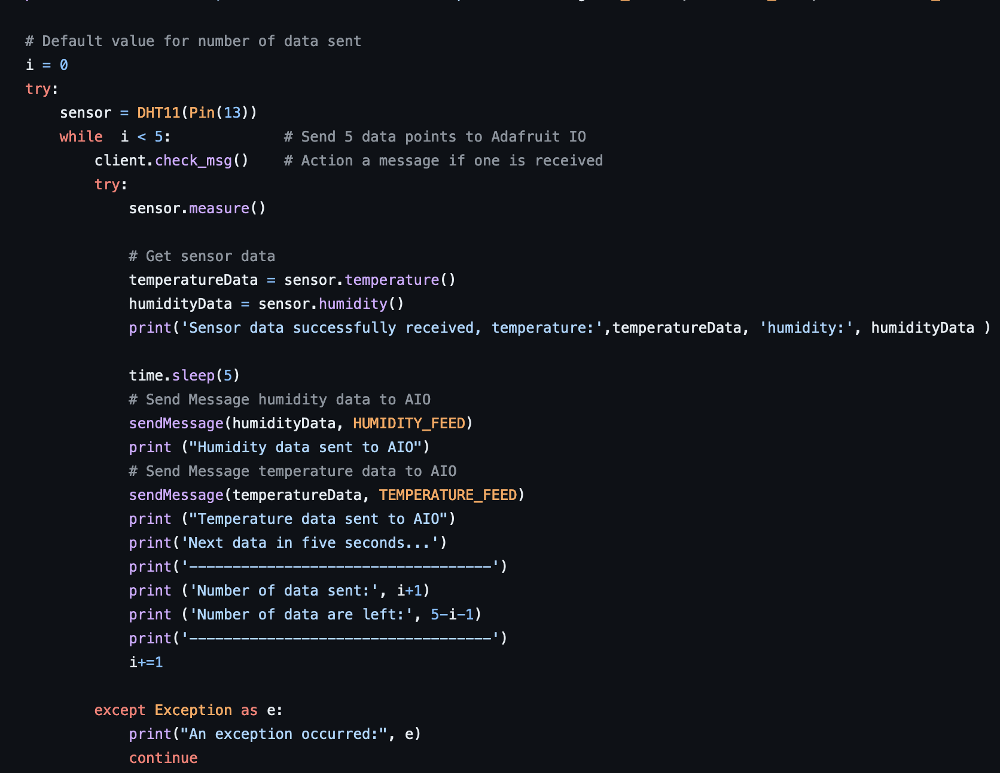
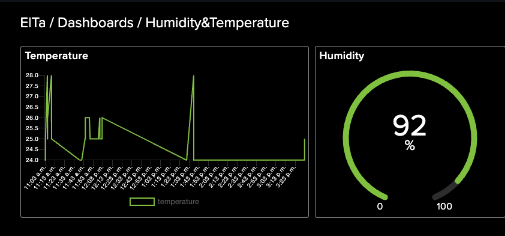
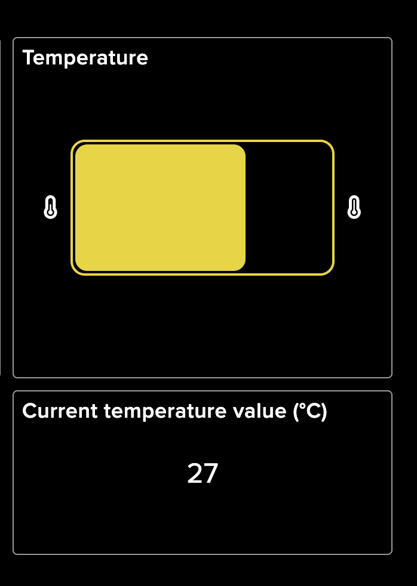

# Tutorial on How to Build a Temperature and Humidity Sensor 

## Building a Temperature and Humidity Sensor with Raspberry Pi Pico W

## Elham Tayebi, et223dt

## Short Project Description 
In this project, we will focus on building a simple temperature and humidity IoT device using the Raspberry Pi Pico W and a DHT11 sensor. The tutorial involves computer setup, setting up the hardware and using a cloud-based service such as Adafruit IO to monitor the data sent by the sensor. This project will take approximately 6-8 hours to complete. 

## Objective 
### Why I Chose This Project?
I chose this project to learn the basics of IoT by building my first IoT device. This project helped me understand how to use a microcontroller (Raspberry Pi Pico W) and connect it to WiFi, how to connect sensors and use cloud services to send data. It is a simple way to get some experiences with IoT and prepare for more advanced projects in the future.

### What purpose does the project serve?
The device serves as a starting point for developing more advance IoT devices. It monitors temperature and humidity, providing a foundation for projects like home automation or weather stations. The project provides a foundation for future IoT applications. 

### What Insights You Think It Will Give

You will learn how to set up and use the Raspberry Pi Pico W, send data to cloud servers and build a basic IoT device by following this tutorial. 

## Material

| Hardware |Image| Price(SEK)/Link|Description|
|----------|----------|----------|----------|
|Raspberry Pi Pico W|    |    [89](https://www.electrokit.com/raspberry-pi-pico-w)     |Raspberry Pi Pico W is a microcontroller with WiFi which is used for IoT applications. |
|Breadboard    |          |      [49](https://www.electrokit.com/kopplingsdack-400-anslutningar)   | The breadboard is used to connect components. |
|Jumperwires     |          |    [29](https://www.electrokit.com/labbsladd-20-pin-15cm-hane/hane)      | Jumper wires are also used to connect the components.|
|DHT11    |          |        [99](https://www.amazon.se/AZDelivery-breakout-modul-Temperatursensor-fuktighetssensor-kompatibel/dp/B07CK598SZ/ref=asc_df_B07CK598SZ/?tag=shpngadsglede-21&linkCode=df0&hvadid=604528123148&hvpos=&hvnetw=g&hvrand=1784732445850451503&hvpone=&hvptwo=&hvqmt=&hvdev=c&hvdvcmdl=&hvlocint=&hvlocphy=1012442&hvtargid=pla-709785471256&mcid=fa9321191f2b374fba918f1bb28c8eda&th=1)  |The DHT11 sensor measures temperature and humidity.|
|Micro-USB cable    |    |   [39](https://www.electrokit.com/usb-kabel-a-hane-micro-b-5p-hane-1.8m)      |The Micro-USB cable is used to connect the device to the computer.
|Total    |          |       305  ||

## Computer Setup
The chosen IDE for this project is Visual Studio Code (VS Code) and the project has been developed on a macOS operating system. 
You need also follow the following steps in order to prepare your computer for the project:
1. [VS code](https://code.visualstudio.com/Download) can be downloaded and installed.
2. [Node.js](https://nodejs.org/en/download/package-manager) can be downloaded and installed.
3. A plug-in called Pymakr is also needed for the project. To install it, open VS code and access the Extensions manager by clicking on the left panel icon, navigating View >> Extensions, or simply by pressing Ctrl+shift+X. 

### Flashing the Raspberry Pi Pico W

1. Download the latest MicroPython firmware(UF2 file) form [this website's ](https://micropython.org/download/RPI_PICO_W/) Releases section.
2. Carefully, connect the micro-USB to the Pico W.
3. Hold down the BOOTSEL button and connect the USB Type-A end of the cable to your computer. Release the button once connected.
4. A new drive named RPI-RP2 will appear. Copy the UF2 file to this drive.
5. Wait for the board to automatically disconnect (drive disappears).
6. To verify the board is ready, disconnect and reconnect the USB cable.

**Note:**  If your device is stuck, you can follow the firmware update procedure with [this special](https://datasheets.raspberrypi.com/soft/flash_nuke.uf2) firmware to completely erase the memory. Afterward, you can follow the previous steps to flash the Pico again. 

## Putting everything together
The DHT11 sensor has three pins: VCC, DATA and GND. Connect the VCC pin on the DHT11 sensor to the 3V3(out) on the Raspberry Pi Pico W. The 3v3 pin is the power pin and it is necessary for the operation of the DHT11 sensor. By doing so, you ensure that the sensor is powered correctly and can communicate with the Pico. Then, connect the GND pin of the DHT11 to any GND pin on the Raspberry Pi Pico W. Here, it is attached to pin 38. The GND (Ground) pin completes the electrical circuit and provides a return path for the current. Finally, Link the DATA pin on DHT11 to GP13. Digital signals can be sent from sensor to the Pico by DATA pin. The GP13 pin is configured to read the digital signals sent from the sensor. See the circuit diagram for a clearer understanding of how to connect all the components. 

 

## Platform

The IoT platform used in this project is [Adafruit IO](https://io.adafruit.com/), a cloud-based service ideal for data storage and visualization. In this project the free plan of Adafruit IO is used. 

### Why Adafruit IO?

- **Easy to Use**: Adafruit IO has a simple interface, making it easy for beginners to understand it.  
- **Integration Support**: Adafruit IO can integrate with many devices and applications using MQTT APIs and REST, making it ideal for different IoT projects. 
- **Free plan**: It offers a free plan for basic IoT projects, allowing users to start without any cost. This is great for small projects such as this project. 
- **Customization Options**: The platform allows users to design feeds and dashboards, allowing for personalized data visualization to meet specific to the project requirements. 

### Comparison with Other Platforms
Another platform, called Datacake was also considered. However, Adafruit IO is more beginner-friendly and easier to understand, which made it the preferable choice for this project. Platforms like AWS IoT or Google Cloud IoT can be taken into consideration if the project requires more advanced features. These platforms provide comprehensive IoT solutions, but they could be more expensive and difficult. 

## The Code 

### WiFi Connection
An important section of the code that links the Raspberry Pi Pico W to WiFi is shown below. In this section, we create a WiFi connection, manage power consumption and deal with connection timeouts. Below, you can find a part of the script for WiFi connection.

  

The code starts by importing the relevant modules and defines the WifiConnection class. The class's constructor initializes the WiFi credentials and interface. The connect method activates the WiFi, configures power management, and attempts to connect using the provided and password. If it is already connected, it will just return your current IP address. If not connected, timing out after 60 seconds. 

This provides efficient WiFi connectivity by using power management and providing real-time connection status feedback. The code is a modified version of wifiConenction.py in this [GitHub repository](https://github.com/iot-lnu/pico-w/blob/main/network-examples/N2_WiFi_MQTT_Webhook_Adafruit/lib/wifiConnection.py). 

### MQTT Communication

The mqtt.py script handles MQTT communication on the Raspberry Pi Pico W. It handles connecting to a MQTT broker, subscribing to topics and establishing a connection to a MQTT broker. With methods for connecting, disconnecting, publishing and subscribing to a MQTT broker, the script defines a MQTTClient class. The code is essentially taken from the [GitHub repository](https://github.com/iot-lnu/pico-w/blob/main/network-examples/N2_WiFi_MQTT_Webhook_Adafruit/lib/mqtt.py ) provided by IoT-LNU, for use with MicroPython on the Raspberry Pi Pico W. 

## Explanation of Configuration Code
The [config.py](https://github.com/elhtay/iot_project_summer24/blob/main/config.py) sets up the WiFi and Adafruit IO parameters, enabling the Pico W to connect to a WiFi network and interact with the Adafruit IO platform. Remember to replace the placeholders in the code with the actual values for your WiFi network, Adafruit IO credentials, and feed names.

## Explanation of main.py

The [main.py](https://github.com/elhtay/iot_project_summer24/blob/main/main.py) sets up the components needed to read temperature and humidity values from DHT11 sensor and transmit it to Adafruit IO. It begins by importing the necessary libraries, initializing the DHT11 sensor and setting up an Adafruit IO client using the provided credentials. The script establishes a WiFi connection using the WifiConnection class and initializes the MQTT client to connect to Adafruit IO. When connected, it loops to read temperature and humidity data from the sensor and publishes this data to the specified Adafruit IO feeds. Finally, the script disconnects from Adafruit IO and the WiFi network once the data has been transmitted. Below, you can find the loop part of the script for main.py.

 

## Transmitting the Data / Connectivity

As mentioned earlier, the data transmission to Adafruit IO server has been implemented using the MQTT protocol over a WiFi connection. The data is transmitted every 5 seconds. WiFi was chosen for its ease of setup and widley available, which makes it a suitable choice for most users. The MQTT protocol was used for its efficient data handling. MQTT is ideal for sending small data packets such as temperature and humidity data. 

### Impact on Device Range 
WiFi is an excellent choice for use within home or office environments. However, its range can be limited in larger areas. For longer-range communication needs, LoRaWAN could be a more suitable option.

### Security Perspective
Using WiFi for data transmission offers WPA2 encryption. Additionally, the MQTT protocol uses username/password authentication and SSL/TLS encryption to ensure data security.

## Presenting the data

### How to setup

1. Go to the [Adafruit IO website](https://io.adafruit.com/).
2. Create a free account if you don't already have one.
3. Log in to your Adafruit account.
4. Navigate to "Feeds" and click on "new feed".
5. Name your feed (for example "Temperature") and save it.
6. Click on the key symbol in the upper right corner of the page.
7. Copy the Active Key. You will need this key to send data from your device to Adafruit IO.
8. Use the AIO key in your code to connect the Paspberry Pi Pico W to Adafruit IO. 
9. Then Navigate to "Dashboards" and choose "new Dashboard".
10. Give your dashboad a name (for example: Humidity&Temperature).
11. Navigate to "Dashboard settings" and click on "Create a new Block"
12. You can now choose your preferred block type to present the data, such as a line chart or a gauge.

The following images show dashboard for the Temperature and Humidity Sensor project, which is build to display real-time data in a user-friendly manner. The data is collected by the sensor and sent to the database where it is stored and retrieved for display on the dashboard. 
The following visual examples has been used:
1. Temperature Graph: The graph shows the temperature variations over time.
2. Humidity Indicator: This displays the current humidity level as a percentage.
3. Temperature Gauge: The gauge shows the current temperature value.

    

## Finalizing the design

This project involved setting up the hardware, writing the necessary code, transmit sensor reading to Adafruit IO and visualization of the data. The project successfully measures and displays temperature and humidity data. The sensor is connected to the Pico W and processes the data and sends it to the cloud service. Overall, the project went well, the setup was straightforward and the sensor provided accurate readings. I had struggled when connecting to WiFi and managed it by troubleshooting various issues, such as incorrect credentials and network settings. However, there are always areas for improvement:

1. Enhance Features: Adding features like alerts or integrating with other IoT devices would enhance the project's functionality. 
2. Code Efficiency: The code could be optimized further for better performance and readability. 

The following pictures show the connection between the Raspberry Pi Pico W and the temperature and humidity sensor, illustrating the final configuration of the project.  

  
  
  